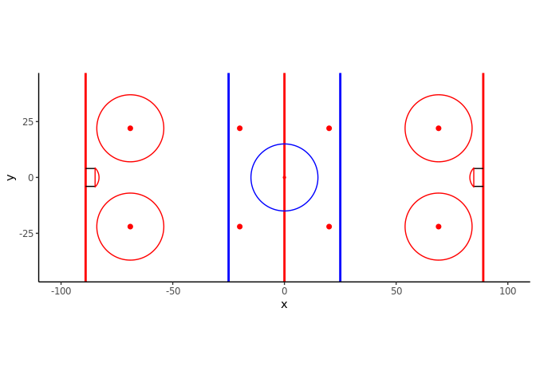
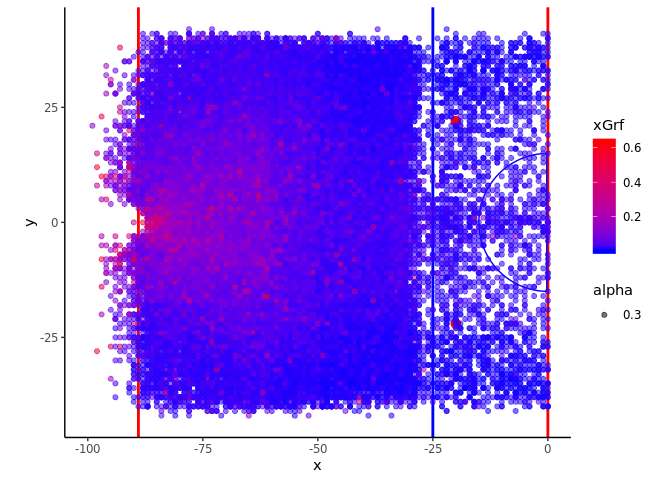
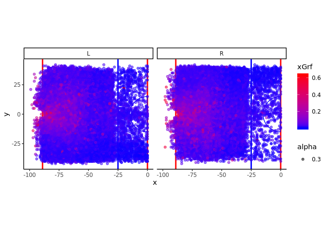

# Data Scraping
You can scrape data from the NHL's API using the code found in the Scraper folder. You can pull data based on a start date and end date with the ability to set them as start and end seasonID's. The below code walks through the code's scraping functions and pulls it all into your local R session. 


```r
source('~/R/Hockey/Scraper/ScrapeHockeyFunctions.r')

seasonInfo <- getSeasonInfo()
if(pullFullSeasons){
  startDate <- seasonInfo %>% filter(seasonId == startDate) %>% dplyr::select(regularSeasonStartDate) %>% unlist()
  
  if(endDate == 'max'){
    endDate <- max(seasonInfo$seasonId)
  } 
  
  endDate <- seasonInfo %>% filter(seasonId == endDate) %>% dplyr::select(seasonEndDate) %>% unlist()
}


cat("Pulling roster data ...\n")
teams <- getTeamData() %>% cleanColumnNames()
teams$runID <- runID
rosters <- getAllRosters(teams) %>% cleanColumnNames()
rosters$runID <- runID
seasons <- getSeasons() %>% cleanColumnNames()
seasons$runID <- runID


cat("Pulling team schedules...\n")
schedule <- getSchedule(startDate = startDate, endDate = endDate) %>% cleanColumnNames()
playedGames <- schedule %>% filter(gameState == 'Final' & gameType != 'PR')


cat("Pulling game event data...\n")
gameEvents <- getGameEventsList(playedGames) 
events <- gameEvents$events %>% cleanColumnNames()
events$runID <- runID
players <- gameEvents$players %>% cleanColumnNames()
players$runID <- runID

cat("Pulling Player Stats...\n")
# TODO: Pull in Player splits and career stats. 
curSeason <- unique(playedGames$season)
if(length(curSeason) > 1){
  playerStats <- do.call(rbind, lapply(curSeason, function(s){
    getPlayerStatsList(season = s, players = unique(players$playerid))  
  })) %>% cleanColumnNames()
  
} else{
  playerStats <- getPlayerStatsList(season = curSeason, players = unique(players$playerid)) %>% cleanColumnNames()
}

playerStats$runID <- as.numeric(runID)

cat("Pull Player Info...")
playerInfo <- (lapply(unique(players$playerid), function(x) getPlayerInfo(x)))
playerInfo <- (bind_rows(playerInfo))
playerInfo$runID <- runID

cat("Pulling Shift Data...")
shiftFrame <- getAllShifts((playedGames$gamePk)) %>% cleanColumnNames() 
shiftFrame$runID <- runID
```


# Expected Goals Model


```
## 
## Attaching package: 'dplyr'
```

```
## The following objects are masked from 'package:stats':
## 
##     filter, lag
```

```
## The following objects are masked from 'package:base':
## 
##     intersect, setdiff, setequal, union
```

Once we collect the data, we can build an expected goals (xG) model that estimates the probability a shot will be a goal based on a variety of factors. 

## Included Variables
* Shot Location (X, Y)
* Shooter Handedness
* Period
* Time Remaining
* Home/Away Team
* Team  Strength: Even or power play
* Shot Type: We impute this when missing, as the NHL does not report the shot type on shots that are not on net. See below for more details on the imputation method.


## Model Structure
We fit xG models using a generalized additive model (GAM) and a random forest.

### GAM model code 
goal ~ s(X, Y, by = as.factor(shootsCatches)) + shootsCatches + 
    as.factor(period) + Strength + teamType + s(timeSecRemaining, 
    by = period) + secondaryUse

### Random Forest model code
ranger(as.factor(goal) ~ X + Y + shootsCatches + period + Strength + 
    teamType + timeSecRemaining + secondaryUse, data = shots, 
    probability = TRUE)


## Shot Type Imputation
We impute shot types so we can fill in blanks that NHL leaves out when a shot attempt is not on net. We use a random forest for this imputation with the below model specification:

ranger(as.factor(secondaryType) ~ Strength + teamType + X + Y + 
    timeSecRemaining + shootsCatches, data = shots %>% filter(!is.na(secondaryType) & 
    !is.na(X) & !is.na(Y) & !is.na(shootsCatches)))

## Results

We can make some cool plots showing the results of the each xG model using our `plotRink` function.

First we can make an empty rink plot to show what the function outputs:

```r
library(ggplot2)
source('~/R/Hockey/plot functions.R')
plotRink()
```

<!-- -->

Now that we have out rink plotting function, we can layer some interesting plots on top of the plot. This first plot just shows all of the shots in the 2018-2019 season colored by xG from the random forest model.


```r
plotRink() + geom_point(data = shots %>% filter(emptyNet != 1) %>% mutate(goal = event == 'Goal'), aes(x = X, y = Y, colour = xGrf, alpha = .3)) + scale_color_gradient(low = 'blue', high = 'red') + xlim(-100, 0)
```

<!-- -->

The next plot does the same thing but facets it out by skater handedness


```r
plotRink() + geom_point(data = shots %>% filter(emptyNet != 1) %>% mutate(goal = event == 'Goal'), aes(x = X, y = Y, colour = xGrf, alpha = .3)) + scale_color_gradient(low = 'blue', high = 'red') + xlim(-100, 0) + facet_wrap(~shootsCatches)
```

<!-- -->
